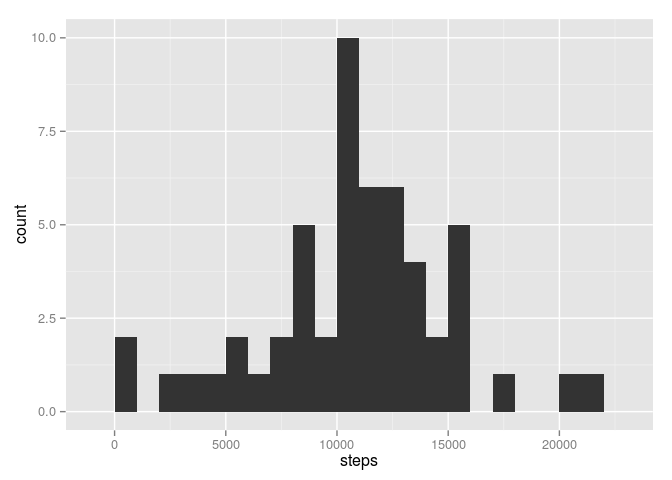
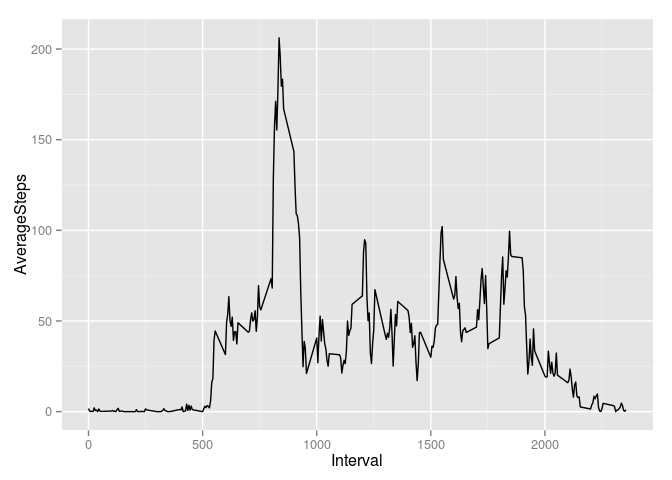
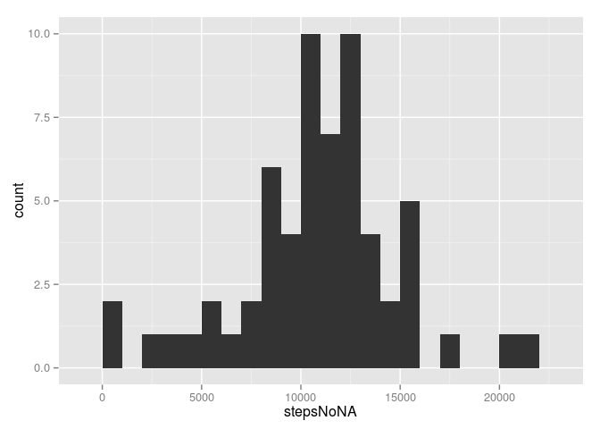
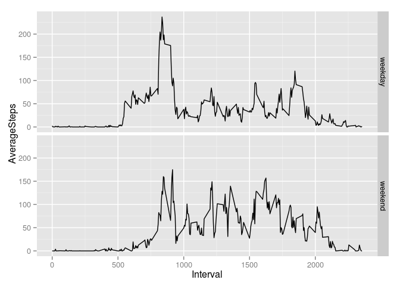

# Reproducible Research: Peer Assessment 1

Include the relevant libraries

```r
library(ggplot2)
library(lubridate)
```

## Loading and preprocessing the data
Extract the data from the zip and read it into R.

```r
rawData <- read.csv(unz("activity.zip", "activity.csv")) 
```

Make the interval column into a factor variable.

```r
rawData$interval <- factor(rawData$interval)
```

Add a column which indicates the weekday and make it into a factor variable

```r
rawData$weekday <- factor(wday(rawData$date,label = TRUE))
```


## What is mean total number of steps taken per day?
First let's see how many observations there are per day

```r
levels(factor(table(rawData$date)))
```

```
## [1] "288"
```

Now we check the occurences of NA per day. From the following we 
deduce that a day has either all data missing or all data available.

```r
aggrNA <- function(x){sum(is.na(x))}
missingPerDay <- aggregate(rawData$steps, list(Day=rawData$date), aggrNA)
levels(factor(missingPerDay$x))
```

```
## [1] "0"   "288"
```

First we calculate the total number of steps in a day. We subsequently remove all NA's from the dataset.

```r
totalPerDay <- aggregate(rawData$steps,list(Day=rawData$date), sum) 
names(totalPerDay)[2] <- "steps"
totalPerDayNoNA <- totalPerDay[!is.na(totalPerDay$steps),]
```

Next, let's make a histogram of the number of steps per day

```r
qplot(steps, data=totalPerDayNoNA, geom="histogram", binwidth = 1000)
```

 

Now let's look for the mean and median of the total steps per day. We don't take the NA values along in the calculation.

```r
meanTotalStepsPerDay <-  mean(totalPerDayNoNA$steps, na.rm=TRUE)
medianTotalStepsPerDay <- median(totalPerDayNoNA$steps, na.rm=TRUE)
meanTotalStepsPerDay
```

```
## [1] 10766.19
```

```r
medianTotalStepsPerDay
```

```
## [1] 10765
```

## What is the average daily activity pattern?
Aggregate the data over all days for each time interval. Plot the results.

```r
AvgPerInt <- aggregate(rawData$steps,list(interval=rawData$interval), mean,  na.rm=TRUE) 
names(AvgPerInt)[2] <- "AverageSteps"
qplot(as.numeric(as.character(interval)), AverageSteps, data=AvgPerInt, geom="line", xlab="Interval")
```

 

Which 5-minute interval, on average across all the days in the dataset, contains the maximum number of steps?

```r
AvgPerInt[AvgPerInt$AverageSteps == max(AvgPerInt$AverageSteps), ]
```

```
##     interval AverageSteps
## 104      835     206.1698
```
Thus, the answer is the 5 minute interval between 835 and 840.

## Imputing missing values
Note that there are a number of days/intervals where there are missing values (coded as NA). The presence of missing days may introduce bias into some calculations or summaries of the data.

Calculate and report the total number of missing values in the dataset (i.e. the total number of rows with NAs)

```r
sum(is.na(rawData$steps))
```

```
## [1] 2304
```
We devise a strategy for filling in all of the missing values in the dataset. The strategy is not sophisticated. We will check what day of the week it is, and then use the mean for the 5 minute interval of that day.
First we make a vector containing the mean of the five minute interval for each weekday

```r
AvgPerIntWday <- aggregate(rawData$steps,list(interval=rawData$interval, weekday=rawData$weekday), mean,  na.rm=TRUE) 
names(AvgPerIntWday)[3] <- "steps"
```
Next we create a loop to replace NA's.

```r
#let's loop through all elements of rawData
n = 1
while (n <= nrow(rawData)){
  if(is.na(rawData$steps[n])){
    #if steps is NA, then replace it with the average for that interval and weekday
    rawData$stepsNoNA[n] <- AvgPerIntWday$steps[AvgPerIntWday$interval == rawData$interval[n] & AvgPerIntWday$weekday == rawData$weekday[n]] 
  } else {
    #else use the original value
    rawData$stepsNoNA[n] <- rawData$steps[n]
  }  
  n = n+1
}
```

First we make a new dataset containing the total number of steps taken each day. Then we make a histogram of the total number of steps taken each day, after missing values were imputed. 

```r
totalPerDayNew <- aggregate(rawData$stepsNoNA,list(Day=rawData$date), sum) 
names(totalPerDayNew)[2] <- "stepsNoNA"

qplot(stepsNoNA, data=totalPerDayNew, geom="histogram", binwidth = 1000)
```

 

Calculate and report the mean and median total number of steps taken per day. 

```r
meanTotalStepsPerDayNew <-  mean(totalPerDayNew$stepsNoNA)
medianTotalStepsPerDayNew <- median(totalPerDayNew$stepsNoNA)
meanTotalStepsPerDayNew
```

```
## [1] 10821.21
```

```r
medianTotalStepsPerDayNew
```

```
## [1] 11015
```
Do these values differ from the estimates from the first part of the assignment? Yes.
What is the impact of imputing missing data on the estimates of the total daily number of steps?
The impact on the mean is:

```r
meanTotalStepsPerDayNew - meanTotalStepsPerDay
```

```
## [1] 55.02092
```
The impact on the median is:

```r
medianTotalStepsPerDayNew - medianTotalStepsPerDay
```

```
## [1] 250
```
## Are there differences in activity patterns between weekdays and weekends?
Create a new factor variable in the dataset with two levels – “weekday” and “weekend” indicating whether a given date is a weekday or weekend day.

```r
rawData$dayType[is.element(rawData$weekday, c("Mon", "Tues", "Wed", "Thurs", "Fri"))] <- "weekday"
rawData$dayType[is.element(rawData$weekday, c("Sat", "Sun"))] <- "weekend"
rawData$dayType <- factor(rawData$dayType)
```

Make a panel plot containing a time series plot (i.e. type = "l") of the 5-minute interval (x-axis) and the average number of steps taken, averaged across all weekday days or weekend days (y-axis). 

```r
AvgPerIntNoNA <- aggregate(rawData$stepsNoNA,list(interval=rawData$interval, dayType = rawData$dayType), mean,  na.rm=TRUE) 
names(AvgPerIntNoNA)[3] <- "AverageSteps"
qplot(as.numeric(as.character(interval)), AverageSteps, data=AvgPerIntNoNA, facets = dayType ~ . , geom="line", xlab="Interval")
```

 
